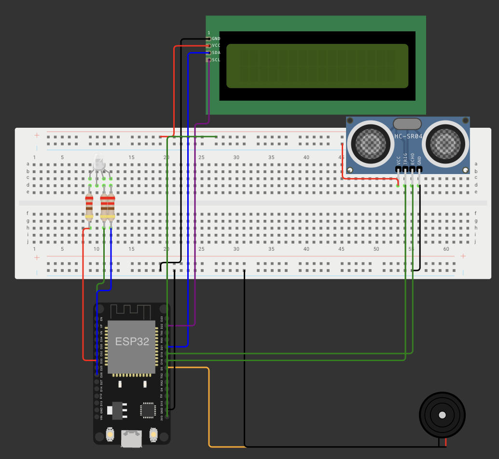

# Atividade 1 - M4-2025

&ensp;Nesta atividade, desenvolvi um sistema de detecção de proximidade utilizando um sensor ultrassônico HC-SR04, que controla um LED RGB e um buzzer de acordo com a distância detectada, além de exibir as informações em um display LCD.

## Objetivo

&ensp;A proposta da atividade foi dada na primeira semana do módulo 4 do Inteli. O desafio era criar um sistema de alerta de proximidade que pudesse ser aplicado em diversos contextos, como sensores de estacionamento, sistemas de segurança ou controle de acesso. O sistema deveria utilizar feedback visual (LED RGB) e sonoro (buzzer) para indicar diferentes níveis de proximidade.

## Funcionamento do Sistema

&ensp;O sistema funciona através da leitura contínua do sensor ultrassônico HC-SR04, que mede a distância de objetos à frente. Com base nessa medição, o comportamento do sistema se adapta conforme descrito abaixo:

### Níveis de Proximidade

- **Muito Perto (< 5cm)**: LED vermelho aceso e buzzer contínuo de alta frequência
- **Perto (5-10cm)**: LED amarelo aceso e buzzer intermitente rápido
- **Médio (10-15cm)**: LED azul aceso e buzzer intermitente lento
- **Longe (> 15cm)**: LED verde aceso e buzzer desligado

&ensp;Todas as leituras são exibidas em tempo real no display LCD, mostrando a distância em centímetros.

## Montagem Física

&ensp;A montagem foi realizada utilizando o simulador Wokwi, que permite testar o circuito antes da implementação física. O esquema de conexões pode ser visualizado no arquivo `diagram.json`.

    Figura 1 - Protótipo no Wokwi 
     
    Fonte: Própria 

&ensp;Após a validação no simulador, o circuito foi implementado fisicamente utilizando os componentes reais.

    Figura 2 - Protótipo Físico 
     
    Fonte: Própria 

### Conexões do Circuito

**Sensor Ultrassônico HC-SR04:**
- VCC → 3.3V do ESP32
- GND → GND
- TRIG → Pino 17 (GPIO17)
- ECHO → Pino 16 (GPIO16)

**LED RGB (Catodo Comum):**
- Pino Vermelho → GPIO 33 (através de resistor 220Ω)
- Pino Verde → GPIO 25 (através de resistor 220Ω)
- Pino Azul → GPIO 26 (através de resistor 220Ω)
- Catodo Comum → GND

**Display LCD I2C:**
- VCC → 3.3V
- GND → GND
- SDA → GPIO 21
- SCL → GPIO 22

**Buzzer:**
- Positivo → GPIO 5
- Negativo → GND

## Tabela de Componentes

&ensp;Abaixo, está a tabela de componentes utilizados na montagem do sistema.

| Componente | Quantidade |
| ---------- | ---------- |
| ESP32 DevKit V1 | 1 |
| Sensor Ultrassônico HC-SR04 | 1 |
| LED RGB (Catodo Comum) | 1 |
| Buzzer | 1 |
| Display LCD 16x2 I2C | 1 |
| Resistores 220Ω | 3 |
| Protoboard | 1 |
| Jumpers | Diversos |

## Código Implementado

&ensp;O código foi desenvolvido em C++ para Arduino/ESP32 e utiliza as bibliotecas `Wire.h` e `LiquidCrystal_I2C.h` para controle do display LCD via comunicação I2C.

### Principais Funções

**`readDistance()`**: Função responsável por realizar a leitura do sensor ultrassônico. Envia um pulso de 10µs no pino TRIG e mede o tempo de retorno no pino ECHO. A distância é calculada usando a fórmula: `distância = (duração × 0.034) / 2`, onde 0.034 é a velocidade do som em cm/µs.

**`setColor(int red, int green, int blue)`**: Função que controla o LED RGB através de PWM (modulação por largura de pulso), permitindo ajustar a intensidade de cada cor individualmente.

**`loop()`**: Loop principal que:
1. Lê a distância do sensor
2. Atualiza o display LCD com a informação
3. Define a cor do LED e o padrão do buzzer baseado na proximidade

## Vídeo Demonstrativo

&ensp;Vídeo demonstrando o funcionamento do sistema: <https://youtu.be/cc18WEWivpA>

## Conclusão

&ensp;Esta atividade permitiu explorar conceitos fundamentais de sistemas embarcados, incluindo leitura de sensores analógicos, controle de dispositivos de saída (LED RGB e buzzer) e comunicação I2C com displays. A implementação no simulador Wokwi facilitou o desenvolvimento e teste do circuito antes de uma eventual montagem física, demonstrando a importância de ferramentas de simulação no processo de prototipagem.