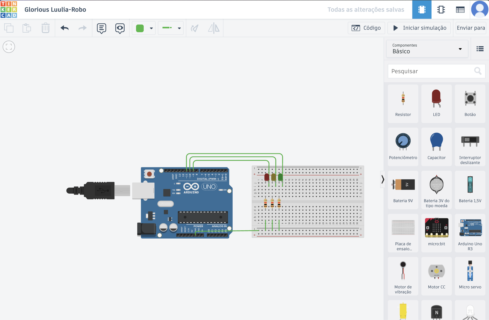

# Ponderada 1 - M4-2025

&ensp; Nesta ponderada, fiz o LED_BUILTIN do Arduino Uno piscar a cada 500ms. Além disso, fiz um mecanismo de sinal usando três leds conectados nas portas 9, 10 e 11. Usei um pouco de lógica de programação para fazer o sinal, o código está no arquivo `ponderada-1.ino`.

## Projeto no Tinkercad

### Demonstração

&ensp;Para demonstrar o funcionamento do código, upei o vídeo no youtube: https://youtu.be/Imn8RIsCNZQ