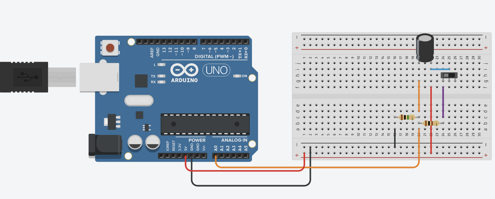
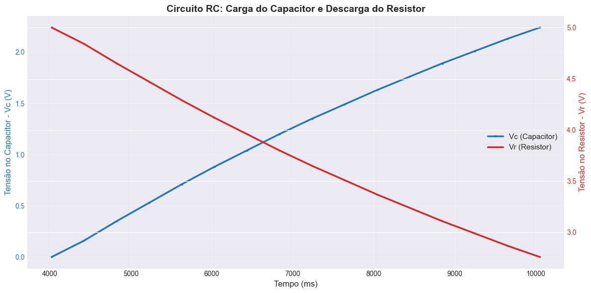

# Ponderada 2 - M4-2025

&ensp; Nesta ponderada, realizei a coleta de dados de um circuito RC para filtragem montado pelo professor. O experimento consistiu em medir a carga e descarga do capacitor e a variação de tensão no resistor ao longo do tempo, demonstrando como o capacitor funciona como um filtro de ruídos.

## Componentes e Valores de Referência

O circuito utiliza os seguintes componentes:

Capacitor (C) - Balde de cargas elétricas armazenadas
- Valor: 10μF / 25V
- Função: Armazena carga e filtra variações rápidas de tensão

Resistor em série (Re) - Limita a corrente
- Valor: 1MΩ

Resistor em paralelo (Rd) - Dissipa energia
- Valor: 100Ω

Fonte de tensão - 5V (o capacitor pode ser substituído por uma fonte de tensão V)

Microcontrolador - Arduino Uno para coleta de dados

## Projeto no Tinkercad

Realizei uma simulação do circuito RC no Tinkercad para validar o comportamento. O Arduino lê a tensão no resistor a cada 400ms através da porta analógica A0 e a transmite pela porta serial em três valores:

1. Tempo (ms)
2. Tensão no Resistor - Vr (V)
3. Tensão no Capacitor - Vc (V)

### Demonstração da simulação

Para demonstrar o funcionamento do circuito no Tinkercad, gravei um vídeo: https://youtu.be/0lVzaiPV11M

## Análise dos resultados com Python

Para entender os resultados obtidos, fiz uma análise dos dados coletados usando Python com as bibliotecas pandas e matplotlib. O código está no arquivo [plot.ipynb](plot.ipynb).

Foram gerados três gráficos:

Gráfico 1: Curva de Carga do Capacitor (Vc)
- Demonstra como a tensão no capacitor aumenta exponencialmente durante a carga
- Tensão inicial: 0.00 V
- Tensão máxima atingida: ~5.00 V

Gráfico 2: Curva de Descarga do Resistor (Vr)
- Mostra como a tensão no resistor diminui conforme o capacitor carrega
- Tensão inicial: 5.00 V
- Tensão final: ~2.76 V (parei o teste antes de chegar a 0V)

Gráfico 3: Gráfico Combinado
- Visualização simultânea de Vc e Vr

Observações importantes:
- Vc + Vr ≈ 5V (Lei de Kirchhoff)
- Quando Vc = 5V, há reinicialização do circuito
- O capacitor filtra variações rápidas de tensão

## Demonstração do projeto físicamente

Para demonstrar o funcionamento do projeto que fizemos no Tinkercad, decidi fazer o projeto fisicamente. Vídeo demonstrando:

https://youtu.be/rpaw_RQ6JeM

## Referências

- Arduino Official Documentation: https://www.arduino.cc/reference/pt/
- Tinkercad: https://www.tinkercad.com/