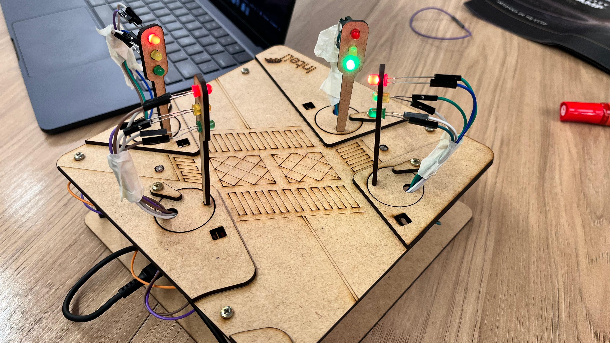
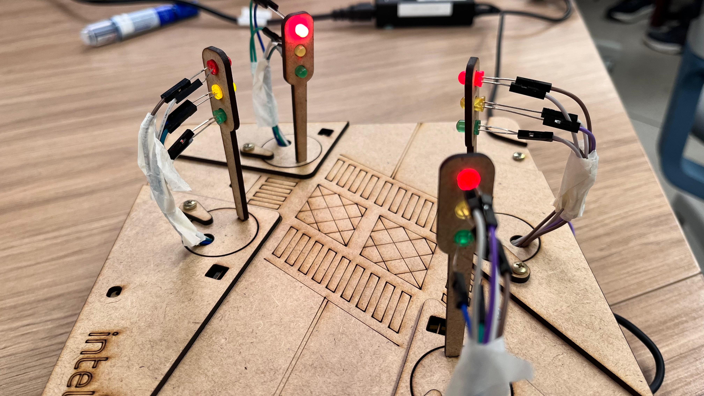
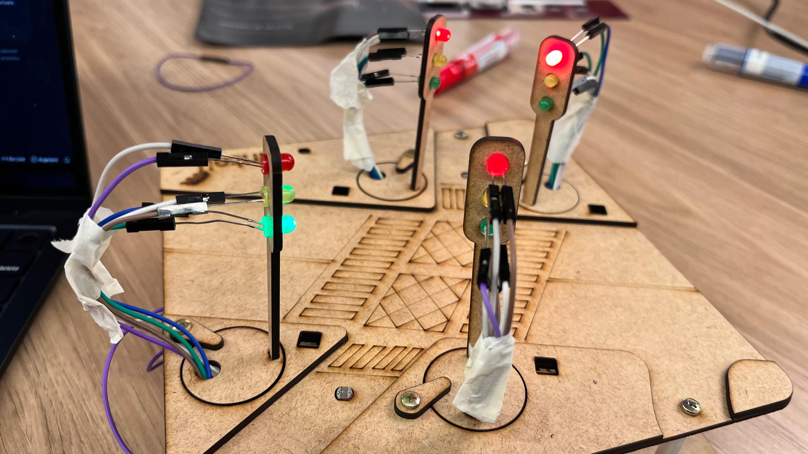
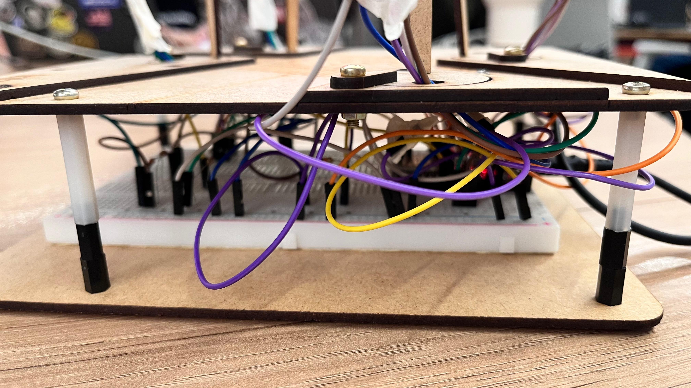
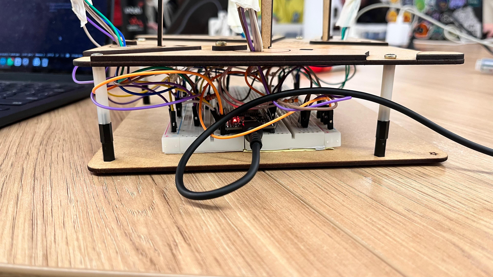
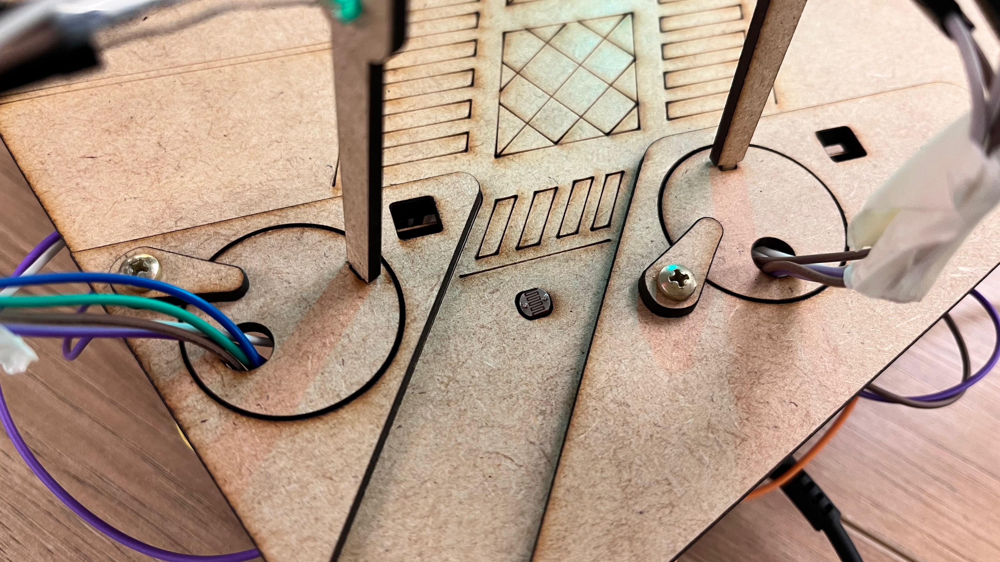
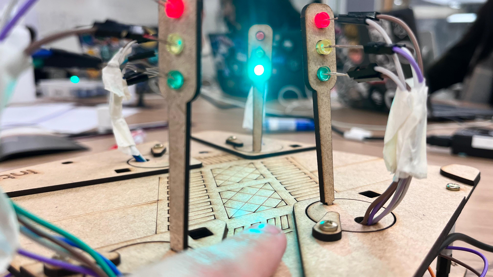
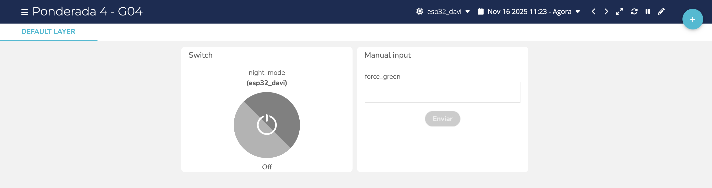

# Ponderada 4 (Grupo) - Controle de Cruzamento com 4 Semáforos

**Feito Por**: Davi Duarte, Maria Clara, Marcos Marcondes, Rayssa Guedes, Pedro Siqueira, Guilherme Hassenpflug, Daniel Guilger

&ensp;Nesta ponderada em grupo, desenvolvemos o controle de um cruzamento com **4 semáforos sincronizados**, utilizando um **ESP32**, integração com a **plataforma Ubidots** e com o **AWS IoT Core**. Além do controle automático de tempo dos sinais, implementamos modos especiais (noturno e “forçar verde”) e um comportamento inteligente baseado em um **sensor LDR** em uma das vias.

## Objetivo

&ensp;A proposta da atividade foi criar um sistema de controle de tráfego para um cruzamento de quatro vias, simulando uma situação real de engenharia de trânsito. O sistema deveria:

- Controlar **4 semáforos** de forma coordenada;
- Permitir **modo noturno** (todos piscando em amarelo);
- Permitir **forçar o verde** em um semáforo específico sob comando remoto;
- Utilizar **IoT** para monitorar/acionar o sistema via **Ubidots** e **AWS IoT Core**;
- Utilizar um **sensor LDR** para detectar a presença de veículo em uma rua e priorizar o semáforo correspondente.

## Descrição Geral do Sistema

&ensp;Montamos um **cruzamento de 4 vias** com semáforos em MDF, cada um com LEDs **vermelho**, **amarelo** e **verde**. O ESP32 gerencia o tempo de cada fase e publica/recebe dados em nuvem.

- O sistema opera em **modo automático**, alternando o verde entre S1, S2, S3 e S4 com tempos de verde e amarelo definidos no código.
- Em **modo noturno**, todos os semáforos piscam em amarelo, simulando menor fluxo durante a madrugada.
- No **modo forçado**, é possível manter um semáforo específico verde (por exemplo, para priorizar uma via) via comando remoto.
- Um **LDR** instalado em uma das vias detecta quando um carro “chega” e força o **Semáforo 2 (S2)** a permanecer verde enquanto o sensor percebe baixa luminosidade (simulando a presença de veículo).

## Montagem Física do Cruzamento

&ensp;O protótipo foi montado em duas placas de MDF, representando as ruas, com 4 conjuntos de semáforos também em MDF, devidamente parafusados. A parte eletrônica foi organizada sobre uma protoboard, ligada ao ESP32.

	Figura 1 - Visão geral do protótipo (ângulo 1) 
	 
	Fonte: Própria 

	Figura 2 - Visão geral do protótipo (ângulo 2) 
	 
	Fonte: Própria 

	Figura 3 - Visão geral do protótipo (ângulo 3) 
	 
	Fonte: Própria 

&ensp;A parte inferior das placas concentra a fiação entre os LEDs, resistores, protoboard e ESP32.

	Figura 4 - Detalhe da fiação na parte inferior (1) 
	 
	Fonte: Própria 

	Figura 5 - Detalhe da fiação na parte inferior (2) 
	 
	Fonte: Própria 

## Sensor LDR e Influência no Semáforo 2

&ensp;Um dos diferenciais do projeto foi o uso de um **sensor LDR** para detectar a presença de um carro em uma das ruas. Quando o LDR detecta baixa luminosidade (simulando um veículo em cima do sensor), o sistema força o **Semáforo 2 (S2)** a ficar verde, priorizando aquela via.

	Figura 6 - Sensor LDR no protótipo 
	 
	Fonte: Própria 

	Figura 7 - Indicação de qual semáforo é afetado pelo LDR 
	 
	Fonte: Própria 

	Figura 8 - Semáforo 2 verde quando o LDR detecta carro 
	 
	Fonte: Própria 

&ensp;No código (`ponderada-4-grupo.ino`), o LDR é lido pela porta analógica `LDR1 (GPIO 33)` e o valor é comparado com um limiar. Quando está “escuro” (carro presente), o sistema chama `setGreenOnly(2);`, garantindo que o S2 fique verde enquanto a condição for verdadeira depois de 1s de delay.

## Modos de Operação

### 1. Modo Automático

&ensp;No modo automático, o cruzamento funciona de forma cíclica, alternando o verde entre os 4 semáforos (S1, S2, S3, S4). A lógica de estado é controlada pelas variáveis `TrafficState` (`GREEN` / `YELLOW`) e pela função `updateTrafficLights()`, que respeita os tempos configurados:

- Tempo de **verde**: `greenTime = 5000` ms;
- Tempo de **amarelo**: `yellowTime = 2000` ms.

### 2. Modo Noturno

&ensp;O **modo noturno** pode ser ativado tanto por botão físico quanto por comando vindo do Ubidots ou AWS. Quando ativo, todos os semáforos ficam apenas piscando em **amarelo**, simulando baixa movimentação no período noturno. Isso é implementado na função `blinkYellowAll()`.

### 3. Modo “Forçar Verde”

&ensp;Também é possível **forçar o verde** em um dos semáforos (de 1 a 4) por comando remoto. Quando um valor entre 1 e 4 é recebido, a função `setGreenOnly(id)` é chamada, colocando todos os outros semáforos em vermelho e deixando apenas o semáforo escolhido em verde. O valor `0` desativa o modo forçado e retorna ao controle automático.

&ensp;Esse comportamento pode ser disparado tanto via **Ubidots** (variável `force_green`) quanto via **AWS IoT Core**, por meio de mensagens MQTT.

## Integração com Ubidots

&ensp;A integração com o **Ubidots** é feita utilizando a biblioteca `UbidotsEsp32Mqtt`. O dispositivo se conecta à rede Wi-Fi, autentica na plataforma e publica/recebe variáveis MQTT.

Variáveis usadas no Ubidots:

- `night_mode`: controla/indica se o modo noturno está ativo (0 ou 1);
- `force_green`: permite escolher qual semáforo deve ser forçado em verde (0 desativa);
- `ldr_1`: valor lido do sensor LDR;
- `active_novo`: indica qual semáforo está verde no momento (1–4).

	Figura 9 - Dashboard no Ubidots monitorando o cruzamento 
	 
	Fonte: Própria 

&ensp;O callback `callback(...)` recebe os comandos do Ubidots e atualiza as variáveis `nightMode` e `forceMode`, além de chamar as funções de controle dos semáforos.

## Integração com AWS IoT Core

&ensp;Além do Ubidots, o projeto também envia dados para o **AWS IoT Core** utilizando MQTT com **TLS** e certificados de cliente. A conexão é configurada por meio da biblioteca nativa `esp_mqtt_client` do ESP-IDF, utilizando os certificados `AWS_CERT_CA`, `AWS_CERT_CRT` e `AWS_CERT_PRIVATE` embutidos no código.

&ensp;O dispositivo se conecta ao broker AWS, assina o tópico `"ponderada"` e publica periodicamente um JSON com o estado do sistema:

- `night`: 0 ou 1, indicando se o modo noturno está ativo;
- `force_mode`: 0 ou 1, indicando se há comando manual ativo;
- `active_green`: qual semáforo está verde (1–4);
- `state`: `"GREEN"` ou `"YELLOW"`;
- `ldr1`: valor atual lido pelo sensor LDR.

&ensp;Também é possível enviar comandos pela AWS para ativar o modo noturno ou forçar o verde em um dos semáforos, respeitando a mesma lógica usada no Ubidots.

## Vídeos Demonstrativos

&ensp;Para complementar a documentação, gravamos dois vídeos demonstrando o funcionamento do sistema:

- **Vídeo 1** – Semáforos, Ubidots, modo noturno, modo automático e modo “forçar semáforo” em funcionamento: <https://youtu.be/YSjTGjViwUk>
- **Vídeo 2** – Demonstração do **LDR** atuando sobre o Semáforo 2 (priorização da via quando há “carro” sobre o sensor): <https://youtu.be/H2KzzAAPj0M>

## Componentes Utilizados

&ensp;Abaixo, a lista de componentes usados na montagem do protótipo do cruzamento:

| Componente                | Quantidade |
| ------------------------- | ---------- |
| Placa de MDF              | 2          |
| Semáforos em MDF          | 4          |
| LED vermelho              | 4          |
| LED amarelo               | 4          |
| LED verde                 | 4          |
| Parafusos                 | 12         |
| Protoboard                | 1          |
| ESP32                     | 1          |
| Resistores                | 13         |
| Sensor LDR                | 1          |
| Cabo micro-USB            | 1          |

## Conclusão

&ensp;Este projeto consolidou diversos conceitos importantes de **sistemas embarcados** e **IoT**: controle de múltiplos semáforos, máquinas de estados, leitura de sensores analógicos, integração com serviços em nuvem (Ubidots e AWS IoT Core) e modos de operação diferentes (automático, noturno, forçado e dependente de sensor).

&ensp;Além de cumprir o objetivo de controlar um cruzamento de forma segura e configurável, o sistema abre espaço para futuras melhorias, como priorização dinâmica baseada em fila de carros, adição de semáforo de pedestres e histórico de dados em dashboards ainda mais completos.
