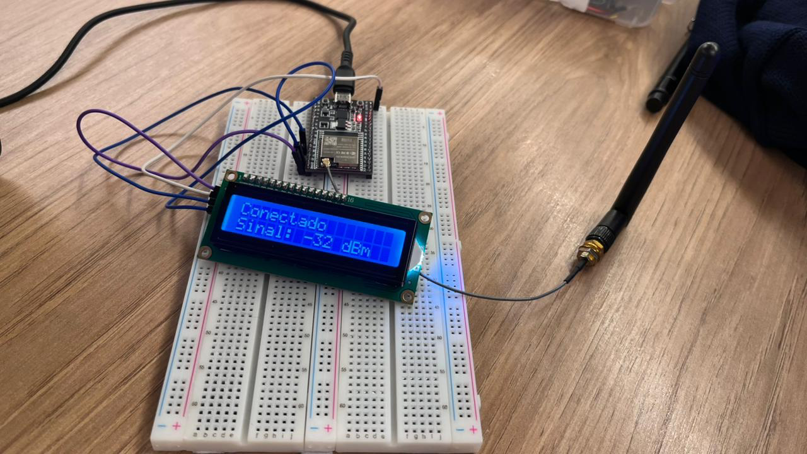
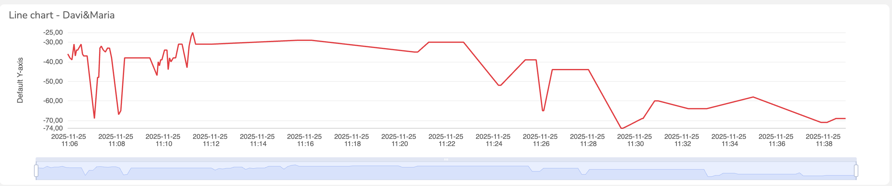
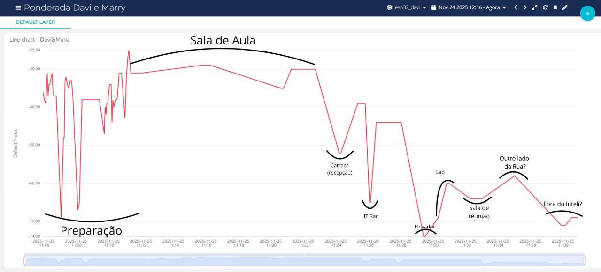

# Ponderada 5 - Medição de Intensidade de Sinal Wi-Fi (Inteli.IoT)

**Feito por**: [Davi Duarte](https://github.com/Yuhtin) e [Maria Clara](https://github.com/slaywithoutd)

&ensp;Nesta ponderada, desenvolvemos um protótipo para medir a intensidade do sinal da rede IoT do Inteli (**Inteli.IoT**) em diversos locais do campus, utilizando um **ESP32** com **antena Wi-Fi externa**, **display LCD** e integração com a plataforma **Ubidots** via **MQTT**.

## Objetivo

&ensp;A proposta da atividade foi criar um sistema portátil capaz de:

- Medir a **intensidade do sinal Wi-Fi (RSSI)** da rede Inteli.IoT em tempo real;
- Exibir os valores de sinal no **display LCD** de forma local;
- Enviar os dados coletados para a **plataforma Ubidots** via protocolo **MQTT**;
- Visualizar as medições em um **gráfico** para análise da cobertura de rede em diferentes áreas do campus.

## Descrição Geral do Sistema

&ensp;O sistema utiliza o ESP32 conectado à rede **Inteli.IoT** para capturar o valor de **RSSI (Received Signal Strength Indicator)**, que representa a potência do sinal Wi-Fi em **dBm** (decibéis-miliwatt). Quanto mais próximo de 0, melhor o sinal; valores mais negativos indicam sinal mais fraco.

&ensp;O protótipo exibe em tempo real no LCD se está conectado ou desconectado da rede, além do nível do sinal atual. A cada 3 segundos, o valor é publicado no Ubidots, permitindo acompanhar as variações do sinal ao longo do tempo e em diferentes locais.

## Montagem Física do Protótipo

&ensp;O protótipo foi montado de forma compacta e portátil, permitindo fácil locomoção pelos diferentes ambientes do campus durante as medições.

	Figura 1 - Protótipo para medição de sinal Wi-Fi 
	 
	Fonte: Própria 

&ensp;O display LCD I2C mostra em tempo real o status da conexão e a intensidade do sinal em dBm, facilitando a visualização durante os testes em campo.

## Locais de Medição

&ensp;Realizamos medições em **8 locais diferentes** do campus do Inteli e arredores, caminhando com o protótipo ligado para capturar as variações de sinal. Os locais foram:

| # | Local |
| - | ----- |
| 1 | Sala de Aula |
| 2 | Catraca da Recepção |
| 3 | IT Bar |
| 4 | Elevador (com a porta fechada) |
| 5 | Laboratório de Eng. Comp. (gerenciado pelo André) |
| 6 | Última sala de reunião do 2º andar (Sistemas de Informação) |
| 7 | Rua na frente da Recepção |
| 8 | Fora da faculdade (calçada da POLI-USP) |

&ensp;Essa variedade de locais permitiu analisar como o sinal se comporta em ambientes internos, externos, com obstáculos (elevador) e fora do alcance esperado da rede.

## Resultados - Gráfico no Ubidots

&ensp;Todas as medições foram enviadas para o Ubidots, onde pudemos visualizar a variação do sinal em um gráfico ao longo do tempo.

	Figura 2 - Gráfico de intensidade do sinal Wi-Fi no Ubidots 
	 
	Fonte: Própria 

&ensp;Para facilitar a análise, também criamos uma versão do gráfico com **indicações visuais** mostrando em qual local estávamos em cada momento da medição:

	Figura 3 - Gráfico com indicações dos locais de medição 
	 
	Fonte: Própria 

&ensp;É possível observar que o sinal varia significativamente dependendo do local. Ambientes mais próximos dos access points apresentam valores mais altos (mais próximos de 0 dBm), enquanto locais como o elevador fechado e a calçada da POLI-USP apresentam sinais mais fracos ou até desconexão.

> **Nota sobre o Elevador**: Ao entrarmos no elevador com a porta aberta, o sinal registrado foi de **-74 dBm**. Porém, quando a porta se fechou, o ESP32 **perdeu completamente a conexão** com a rede Inteli.IoT e não conseguiu enviar mais dados para o Ubidots. Por esse motivo, no gráfico aparece apenas a medição de -74 dBm e, em seguida, já é exibida a medição do Laboratório de Eng. Comp. Isso demonstra como estruturas metálicas (como a cabine do elevador) podem bloquear sinais de Wi-Fi de forma significativa.

## Funcionamento do Código

&ensp;O código (`ponderada-5.ino`) realiza as seguintes operações:

1. **Inicialização**: Configura o LCD, conecta-se à rede Wi-Fi Inteli.IoT e estabelece conexão com o Ubidots via MQTT;
2. **Loop principal**:
   - Verifica o status da conexão Wi-Fi;
   - Se conectado, lê o valor de RSSI com `WiFi.RSSI()` e exibe no LCD;
   - A cada 3 segundos (`PUBLISH_FREQUENCY`), publica o valor no Ubidots;
   - Se desconectado, exibe mensagem no LCD e tenta reconectar.

&ensp;A variável `RSSI` é publicada no Ubidots sob o label `dbm`, permitindo a criação de gráficos e análises na plataforma.

## Componentes Utilizados

&ensp;Abaixo, a lista de componentes usados na montagem do protótipo:

| Componente | Quantidade |
| ---------- | ---------- |
| ESP32 | 1 |
| Antena Wi-Fi (conectada ao ESP32) | 1 |
| Protoboard | 1 |
| LCD I2C (16x2) | 1 |
| Jumpers | 4 |
| Cabo micro-USB | 1 |

## Vídeo Demonstrativo

&ensp;Gravamos um vídeo demonstrando o processo de medição em cada local do campus:

- **Vídeo** – Medição de sinal Wi-Fi em diferentes locais do Inteli: <https://youtube.com/shorts/5kBD5HtEkkc?si=xWZcVG5RzJMA9RhY>

## Conclusão

&ensp;Este projeto foi uma excelente oportunidade para aplicar conceitos de **IoT**, **protocolos MQTT** e **integração com plataformas em nuvem**. A atividade permitiu:

- Entender na prática como funciona a medição de intensidade de sinal (RSSI);
- Observar como fatores ambientais (paredes, elevadores, distância) afetam a qualidade do sinal Wi-Fi;
- Criar um sistema portátil para análise de cobertura de rede;
- Integrar dispositivos embarcados com dashboards de visualização na nuvem.

&ensp;Os dados coletados podem ser úteis para identificar pontos de melhoria na cobertura da rede IoT do campus, contribuindo para uma infraestrutura de conectividade mais eficiente.
